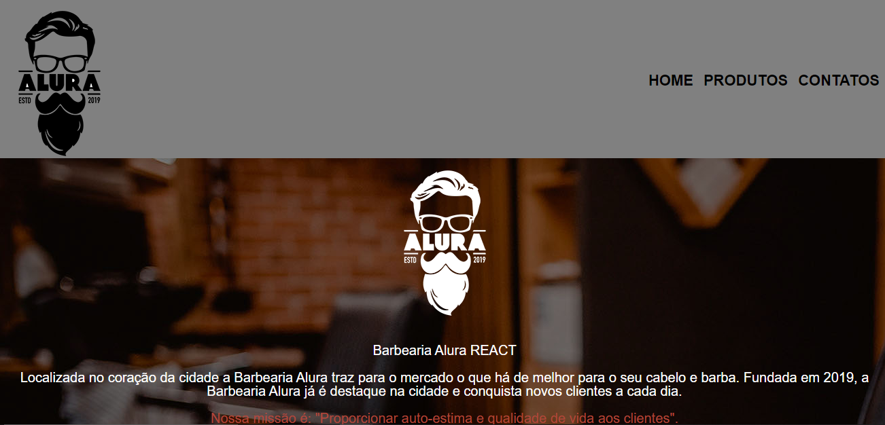

#  Barbearia Alura React
# Pagina Web da barbearia Alura feita em React

## Tecnologias Utilizadas no front-end:
|HTML|CSS|JavaScript|ReactJS|
|-|-|-|-|
|||||
|Sintaxe JSX|Utilizado na estilização das páginas e dos componentes com styled components|Aplicação das funcionalidades com o Framework React|Recursos Utilizados: Function Components, React Router DOM, React Hooks|
___
___
[Clique aqui](https://barbearia-alura-react.vercel.app/) para acessar o App
___
